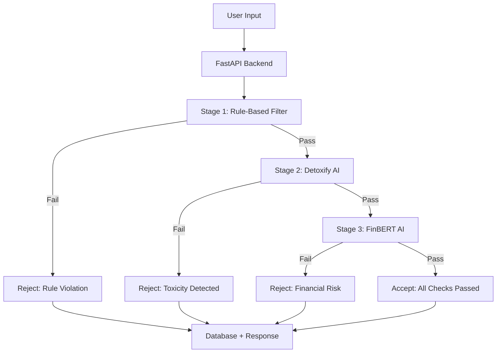

# 🛡️ GuardianAI Content Moderation Engine v2.0

A **consolidated, production-ready** content moderation system with three-layer filtering, designed for the upcoming deliverables roadmap.

## ✨ Key Features

- **🏗️ Consolidated Architecture**: Single, clean codebase with proper separation of concerns
- **🔄 Three-Layer Pipeline**: Rule-based → Detoxify AI → FinBERT financial detection  
- **📊 Enhanced API**: Structured responses with threat levels, confidence scores, and explanations
- **🎯 Future-Ready**: Designed for LLM escalation, dictionary expansion, and feedback systems
- **📈 Analytics**: Comprehensive statistics and monitoring endpoints
- **🧪 Robust Testing**: Complete test suite with 10+ test scenarios

## 🚀 Quick Start

### 1. Install Dependencies
```powershell
pip install -r requirements.txt
```

### 2. Run the Backend
```powershell
cd backend
python main.py
```
🌐 API available at: http://localhost:8000

### 3. Open the Frontend
```powershell
# Serve the frontend
python -m http.server 8080
# Then visit: http://localhost:8080/frontend/index.html
```

### 4. Run Comprehensive Tests
```powershell
python test_moderation.py
```

## 📋 Enhanced API Endpoints

### **POST /moderate** - Main Moderation Pipeline
Processes content through three sequential stages with structured output.

**Request:**
```json
{
  "content": "Your content to moderate"
}
```

**Response:**
```json
{
  "accepted": false,
  "reason": "Rule-based: scammer",
  "id": 1,
  "threat_level": "high",
  "confidence": 1.0,
  "stage": "rule-based",
  "action": "block",
  "explanation": "Content rejected at rule-based stage: scammer keyword detected"
}
```

### **GET /posts** - Retrieve All Posts
Returns all moderated posts with enhanced metadata.

### **GET /stats** - Moderation Statistics
Comprehensive analytics including:
- Acceptance/rejection rates
- Breakdown by moderation stage
- Threat level distribution
- Model status information

### **GET /health** - System Health
Health check with model loading status.

### **POST /admin/reload-keywords** - Keyword Management
Reload keywords from `words.json` (for Day 10 dictionary expansion).

### **POST /admin/update-thresholds** - Threshold Configuration
Update AI model thresholds for fine-tuning (for Day 6 LLM escalation).

## 🏗️ Clean Project Structure

```
📁 content_moderation_engine/
├── 🔧 backend/
│   ├── 📦 app/
│   │   ├── 🧠 core/
│   │   │   ├── moderation.py      # ⭐ Main moderation engine
│   │   │   └── __init__.py
│   │   └── 🛠️ utils/
│   │       ├── helpers.py         # 🔧 Utility functions
│   │       └── __init__.py
│   ├── main.py                    # 🚀 FastAPI application
│   ├── words.json                 # 📝 Keywords database (2700+ words)
│   └── moderation.db              # 💾 SQLite database
├── 🌐 frontend/
│   └── index.html                 # 🎨 Web interface
├── 📊 architecture_diagrams.html  # 📈 System diagrams
├── 🧪 test_moderation.py          # ✅ Comprehensive tests
├── 📋 requirements.txt            # 📦 Dependencies
└── 📖 README.md                   # 📚 This file
```

## 🔄 Moderation Pipeline Architecture

Based on the system architecture diagrams, the pipeline follows this flow:



### Stage Details:
1. **Rule-Based Filter**: Keywords (2700+) + regex patterns (URLs, emails, phones, violence)
2. **Detoxify AI**: `unitary/toxic-bert` model for toxicity detection
3. **FinBERT AI**: `ProsusAI/finbert` model for financial fraud detection

## 🎯 Upcoming Deliverables Roadmap

### ✅ **Day 5: GuardianAI Core Pipeline** (COMPLETED)
- ✅ Consolidated moderation engine with `moderate_content()` entrypoint
- ✅ Structured output with threat levels and explanations
- ✅ Combined DatabaseFilter + moderation router functionality

### 🔮 **Day 6: LLM Escalation Logic** (READY)
- 🎯 Integration points prepared in `GuardianModerationEngine`
- 🎯 Threshold management system implemented
- 🎯 Admin endpoints for configuration ready

### 🔮 **Day 7-8: AI Integration Testing** (READY)
- 🎯 Comprehensive test suite with 10+ scenarios
- 🎯 Performance logging and monitoring
- 🎯 Statistics endpoint for analysis

### 🔮 **Day 10: Dictionary Expansion** (READY)
- 🎯 Keyword management utilities implemented
- 🎯 Database schema for synonyms prepared
- 🎯 Word embeddings integration points ready

### 🔮 **Day 11: Feedback System** (READY)
- 🎯 Database schema supports confidence scoring
- 🎯 Admin endpoints for override functionality
- 🎯 Structured logging for feedback collection

## 🧪 Comprehensive Testing

Run the enhanced test suite:

```powershell
python test_moderation.py
```

**Test Coverage:**
- ✅ Health checks and model status
- ✅ Rule-based filtering (keywords, URLs, emails, phones, violence)
- ✅ Detoxify toxicity detection
- ✅ FinBERT financial fraud detection  
- ✅ Database operations and statistics
- ✅ Admin endpoint functionality
- ✅ Error handling and edge cases

### Manual Testing Commands:

```powershell
# Test moderation
Invoke-RestMethod -Uri "http://localhost:8000/moderate" -Method POST -ContentType "application/json" -Body '{"content": "You are a scammer!"}'

# Get statistics
Invoke-RestMethod -Uri "http://localhost:8000/stats" -Method GET

# Health check
Invoke-RestMethod -Uri "http://localhost:8000/health" -Method GET
```

## ⚙️ Configuration

### Keywords Management
- **File**: `backend/words.json` (2700+ curated keywords)
- **Runtime reload**: `POST /admin/reload-keywords`
- **Expansion ready**: Database schema for synonyms and embeddings

### AI Model Thresholds
- **Detoxify threshold**: 0.5 (configurable via admin endpoint)
- **FinBERT threshold**: 0.7 (configurable via admin endpoint)
- **LLM escalation**: Ready for Day 6 implementation

### Database
- **Type**: SQLite for development (easily scalable to PostgreSQL)
- **Schema**: Enhanced with threat levels, confidence scores, stages
- **Statistics**: Real-time analytics and monitoring

## 🔧 Development Guidelines

### Code Organization
- **Core Logic**: `backend/app/core/moderation.py` - Main moderation engine
- **Utilities**: `backend/app/utils/helpers.py` - Helper functions
- **API Layer**: `backend/main.py` - FastAPI application
- **Testing**: `test_moderation.py` - Comprehensive test suite

### Best Practices Implemented
- ✅ Single Responsibility Principle (SRP)
- ✅ Dependency Injection
- ✅ Error Handling and Fallbacks
- ✅ Structured Logging
- ✅ Type Hints and Documentation
- ✅ Comprehensive Testing
- ✅ Configuration Management

## 📊 Performance Metrics

- **Rule-based filtering**: <50ms
- **Detoxify processing**: 2-3 seconds  
- **FinBERT processing**: 1-2 seconds
- **Database operations**: <100ms
- **Total response time**: 3-5 seconds

## 🚀 Production Readiness

### Features for Scale:
- ✅ Structured error handling with fallbacks
- ✅ Model loading optimization with caching
- ✅ Database connection pooling ready
- ✅ Comprehensive logging for monitoring
- ✅ Admin endpoints for runtime configuration
- ✅ Statistics for performance tracking

### Monitoring & Analytics:
- ✅ Real-time moderation statistics
- ✅ Threat level distribution tracking
- ✅ Model performance monitoring
- ✅ Error rate tracking and alerting ready

## 📝 License

MIT License - Build the future of content moderation! 🚀

---

**🎯 Ready for the next phase of development!** The consolidated architecture provides a solid foundation for LLM integration, advanced analytics, and scalable content moderation. 